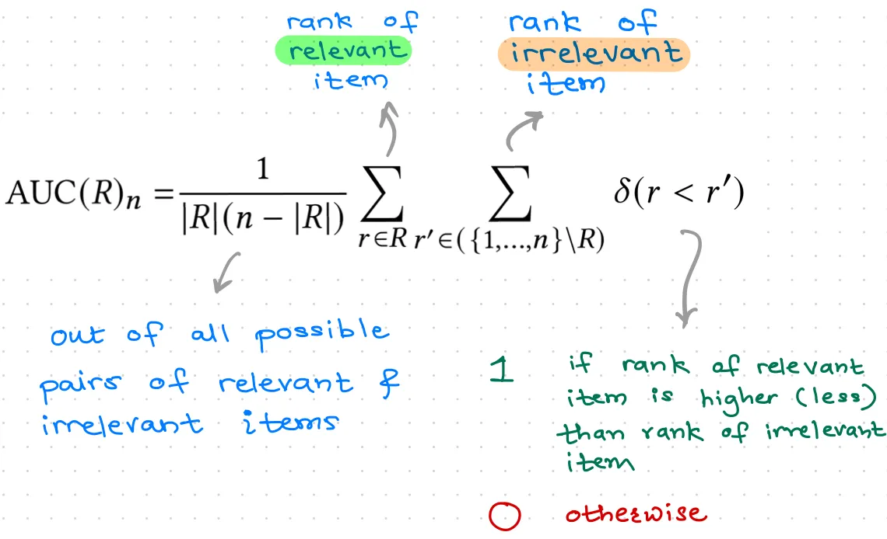
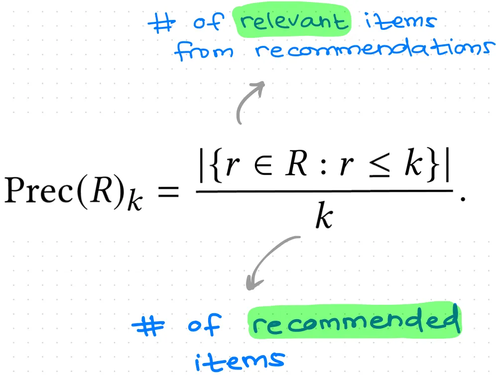
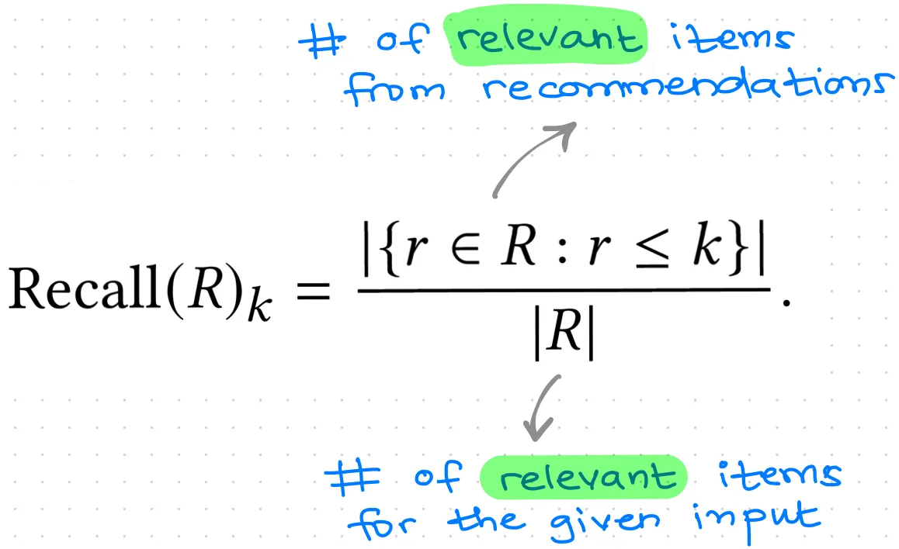
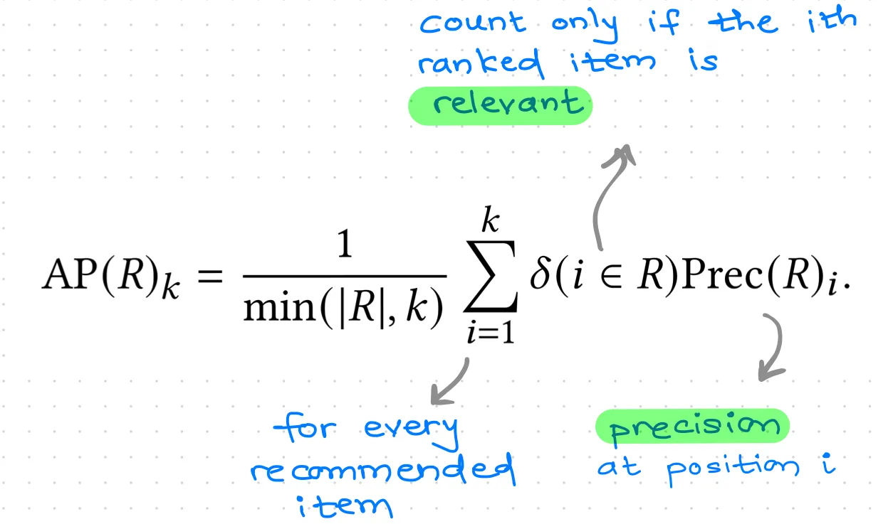

# Evaluation

## Offline

### Ref.

- [common metrics to evaluate rec. systems](https://flowthytensor.medium.com/some-metrics-to-evaluate-recommendation-systems-9e0cf0c8b6cf)

### AUC
<div align="center"></div>

``` SQL
-- SQL Calc AUC

WITH pick_auc_info AS (
    select channel, uv, action_uv, g_cnt, action_g_cnt, 
        (action_ry - 0.5 * action_n1 * (action_n1 + 1)) / action_n0 / action_n1 as auc
    from (  
        select channel, 
            count(distinct user_id) as uv, 
            count(distinct case when pick_label = 1 then user_id end) as action_uv, 
            count(1) as g_cnt, -- 'g' is short for group
            count(case when pick_label = 1 then 1 end) as action_g_cnt, 
            sum(if (pick_label = 0, 1, 0)) as action_n0, 
            sum(if (pick_label = 1, 1, 0)) as action_n1,
            sum(if (pick_label = 1, rk, 0)) as action_ry
        from (
            select channel, user_id, search_id, product_id, pick_label, 
                row_number() over (partition by channel order by pick_score ASC) AS rk
            from  base_info
        )
        group by 
            channel
    )
)

-- SQL Calc UAUC
WITH rank_info AS (
    SELECT user_id, product_id, search_id, pick_label, pick_score, 
        row_number() over (partition by user_id order by pick_score ASC) AS u_pick_rk, 
    FROM base_info
),

pick_uauc_info AS (
    select channel, 
        sum(pv) as action_pv, 
        count(inner_count) as user_count, 
        sum(inner_count) as count, 
        sum(action_auc * inner_count) / sum(inner_count) AS uauc
    from (
        select channel, user_id, pv, inner_count, sum_label, 
            (action_ry - 0.5 * action_n1 * (action_n1 + 1)) / action_n0 / action_n1 as action_auc
        from (
            select channel, user_id, 1 as pv, 
                count(1) as inner_count, 
                sum(pick_label) as sum_label, 
                sum(if (pick_label = 0, 1, 0)) as action_n0,
                sum(if (pick_label = 1, 1, 0)) as action_n1,
                sum(if (pick_label = 1, u_pick_rk, 0)) as action_ry
            from rank_info 
            group by user_id, channel
        )
        where sum_label > 0 
        and sum_label <> inner_count
    )
    group by channel
)
```

### Precision @ K
<div align="center"></div>

### Recall @ K
<div align="center"></div>

### Average Precision @ K
<div align="center"></div>

### NDCG @ K
<div align="center"></div>