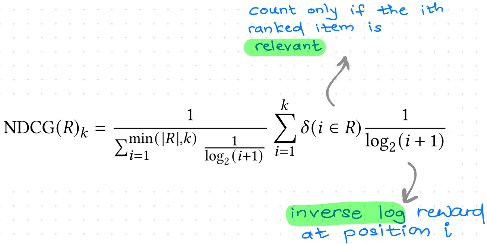

# Evaluation

## Offline

### Ref.

- [common metrics to evaluate rec. systems](https://flowthytensor.medium.com/some-metrics-to-evaluate-recommendation-systems-9e0cf0c8b6cf)

### AUC

### Precision @ K

### Recall @ K

### Average Precision @ K

### NDCG @ K

